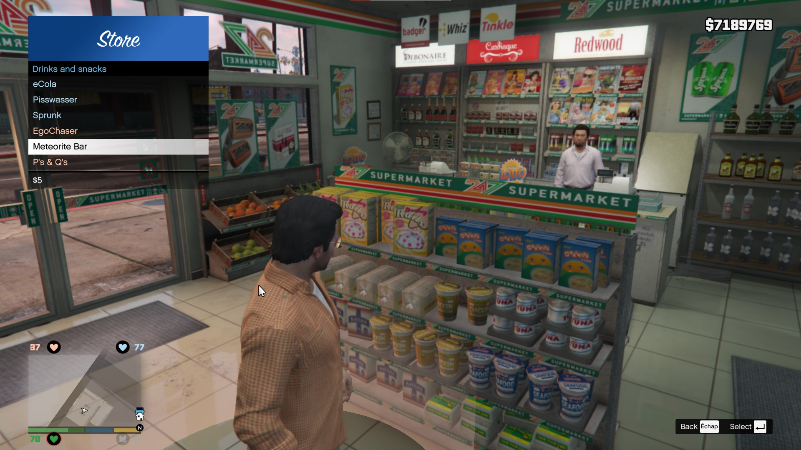

# HAHT Display - *RPH Plugin*
*Health Armour Hunger Thirst*

This RAGE Plugin Hook Plugin adds visual indicators for the player's health, armor, hunger, and thirst. And implement a small hunger/thirst system, 

## How it works
- Icons and value are displayed around the minimap.
- Hunger and thirst values decrease over time (more or less quickly depending on whether the player is running, swimming, etc.).
- You can buy snacks and drinks in the stores around the map (look for the marker and press the key (<kbd>E</kbd> by default)).
- You can consume your snacks/drinks by opening your inventory (<kbd>Ctrl + I</kbd> by default).

## Configuration
You can adjust some values in the `.ini` file :
- ↔ The position and color of the icons/values.
- ⏱ The speed at which hunger/thirst values decreases.
- 🙋‍ The animations to play while eating/drinking.
- 🏪 Stores location and snacks/drinks types.
- ⌨ Keys....

## Prerequisites
- [RAGE Plugin Hook](https://ragepluginhook.net/Downloads.aspx)
- [RAGENativeUI](https://github.com/alexguirre/RAGENativeUI/releases)

## Recommendation
- [Circle HD Minimap](https://www.gta5-mods.com/misc/circle-hd-minimap)